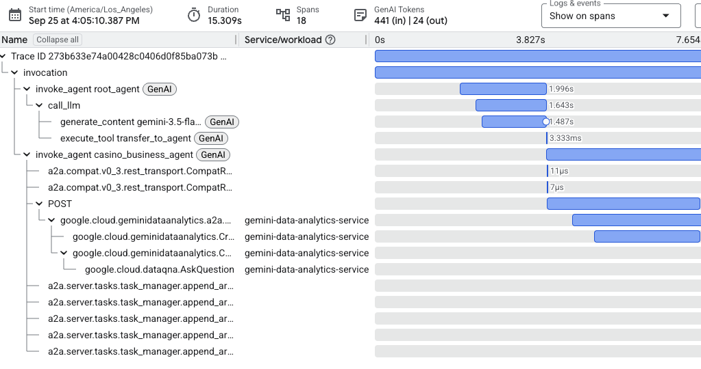
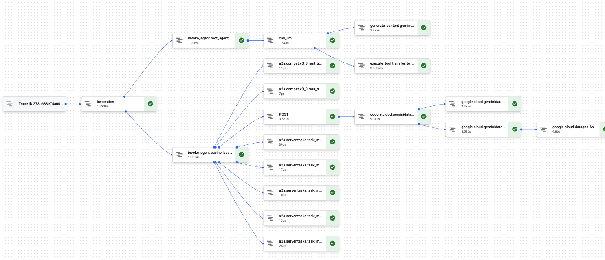

# Gemini Data Analytics (GDA) Multi-Agent Routing with ADK & A2A

## Architecture Overview

When you create and publish a Conversational Analytics / Gemini Data Analytics (GDA) agent, the GDA platform automatically provisions  standard A2A contract endpoints under `geminidataanalytics.googleapis.com` namespace. This is fully managed and serverless  with the Google Cloud Platform. [See API documentation here. ](https://docs.cloud.google.com/gemini/data-agents/reference/rest/v1/a2a.projects.locations.agents.v1.message/stream). The `.../message:stream` endpoint provides the bidirectional connection for conversations. The `.../card` endpoint provides the agent card. 

Because A2A protocol standardizes agent capability discovery (via Agent Cards), message exhcnage, and session negotiation, you can expose A2A server interfaces for published agent data agents for external orchestrators to discover and use regardless of how consuming agent is built. This protocol decoupling allows for federated access to A2A agents authored across teams, organizations, and projects. For example, a GDA agent published by your data engineering team can be discovered and invoked by your marketing team's Gemini Enterprise agent and your custom multi-agent ADK application. This demo shows an example of the latter - using ADK framework, we build an orchestrator agent that discovers accessible GDA agents and delegates user queries to the most appropriate agent based on the descriptions, example queries, etc exposed by  each "remote"/A2A agent's agent card. 

### Demo Scope
This demo is built for BigQuery sources. It does not include the credentials required to authenticate to Looker sources or databases sources. The response handling doesn't include Looker or database specific parts. 

### Ideal Use Cases for A2A

| Use Case | Why A2A is the Right Fit |
| :--- | :--- |
| **Multi-Domain Delegation** | Instead of overloading a single model with hundreds of table schemas in one massive prompt, route queries to smaller, domain-specialized agents. |
| **Independent Team Ownership** | Data teams can configure, update, and govern GDA data agents independently in BigQuery and Google Cloud Console, while application teams consume them via A2A without code redeployments. |
| **Rich Artifact Streaming** | Stream tabular query results, intermediate reasoning steps, and visualization charts progressively as they arrive from BigQuery. |
| **Heterogeneous Environments** | Connect agents built on different frameworks (ADK, LangChain, custom backends) or deployed across different Google Cloud projects and environments. |

---

## 🧩 How A2A Integrates with Google ADK

The **Google Agent Development Kit (ADK)** is Google's framework for building agentic architectures in Python. 

In this application:
1. **The Orchestrator (`root_agent`)**: A native ADK `Agent` initialized with Gemini that acts as a supervisor. Its sole job is to interpret user intent and decide which domain agent should handle the question. Adjust `ROUTER_INSTRUCTION` in `agent.py` to suit your routing requirements. Using a lighter weight model here speeds up the routing decisions.
2. **The Remote Sub-Agents (`RemoteA2aAgent`)**: Each specialized GDA agent is registered as a sub-agent of `root_agent` using ADK's `RemoteA2aAgent`. To the router, a remote A2A agent behaves just like any local sub-agent.
   * **Dynamic Discovery via GDA API**: At startup, `list_gda_agents()` queries GDA's `list_accessible_data_agents`, which makes a GDA API `ListAccessibleDataAgentsRequest` to return DataAgents residing within the project and location that the caller (via `DataAgentServiceClient`) has IAM permissions to access (e.g. via `geminidatananalytics.dataAgentUser` role). `ListAccessibleDataAgentsRequest` supports optional `filter` and `creator_filter` parameters. Here we use `filter` to filter by data agent labels. This is optional.
3. **Execution & Event Conversion**: When the router delegates a task, ADK automatically invokes the remote agent via A2A REST/SSE transport, converts A2A task status updates and artifacts into native ADK events, and streams them to the user.

```
┌────────────────────────────────────────────────────────┐
│                      User Query                        │
└───────────────────────────┬────────────────────────────┘
                            │
                            ▼
┌────────────────────────────────────────────────────────┐
│             Google ADK Supervisor Agent                │
│                     (root_agent)                       │
│    - Evaluates intent                                  │
│    - Selects domain agent                              │
│    - Calls execute_tool transfer_to_agent              │
└─────────────┬────────────────────────────┬─────────────┘
              │ (A2A Protocol / REST)      │ (A2A Protocol / REST)
              ▼                            ▼
┌───────────────────────────┐┌───────────────────────────┐
│    GDA Domain Agent A     ││    GDA Domain Agent B     │
│   - Domain BigQuery Data  ││   - Domain BigQuery Data  │
│   - Natural Language to   ││   - Natural Language to   │
│     SQL Engine            ││     SQL Engine            │
└───────────────────────────┘└───────────────────────────┘
```

---

## 🔍 End-to-End Observability & Distributed Tracing

In enterprise multi-agent systems, visibility into latency and execution flow is critical. You need to know:
* How long did the router take to classify the intent?
* When did the network call to the remote agent start?
* How long did GDA spend generating the SQL and querying BigQuery?

### The Challenge: Disconnected Traces
When the local ADK router delegates to a remote GDA agent over HTTP, the outgoing request is handled by an HTTP client (`httpx`). By default, third-party HTTP clients do not automatically attach OpenTelemetry trace headers. As a result, the downstream GDA service creates a new, isolated trace with a different Trace ID, breaking end-to-end visibility.

### `HTTPXClientInstrumentor().instrument()`
In [`app/fast_api_app.py`](file:///Users/liuchristie/Projects/gda-agents-routing/gda-agents-routing/app/fast_api_app.py), we initialize automatic OpenTelemetry instrumentation for HTTPX:

* We use `HTTPXClientInstrumentor` to automatically intercept every outgoing HTTP request made by the A2A client and inject standard W3C Trace Context headers (`traceparent`).
* The downstream Gemini Data Analytics service reads this header and attaches its internal processing spans as children of the outgoing HTTP request.
* **Result**: You get a single, unified Trace ID spanning from the user's initial prompt in ADK all the way through GDA telemetry provided when you [enable GDA monitoring](https://docs.cloud.google.com/bigquery/docs/create-data-agents#monitor_agents_and_conversations) in your project.





---

## 📁 Project Structure

```
gda-agents-routing/
├── app/
│   ├── agent.py               # Main ADK root_agent & routing logic
│   ├── remote_agents.py       # A2A client wrapper, card discovery, & parsers
│   ├── fast_api_app.py        # FastAPI server with A2A routes & OpenTelemetry setup
│   ├── render_chart.py        # Vega-Lite chart theme and markdown renderer
│   ├── config.py              # Configuration and environment settings
│   └── app_utils/             # ADK and A2A service utilities
├── tests/
│   ├── unit/                  # Unit tests (parsers, renderers, auth)
│   └── integration/           # Integration tests for agent routing
├── pyproject.toml             # Project dependencies (managed via uv)
└── README.md                  # This documentation
```

---

## 🚀 Quick Start

### 1. Prerequisites
* **Python 3.11+**
* **uv**: Fast Python package manager ([Installation Guide](https://docs.astral.sh/uv/getting-started/installation/))
* **Google Cloud SDK**: Authenticated with your GCP project (`gcloud auth application-default login`)

### 2. Configure Environment Variables
Create a `.env` file in the project root:

```env
# Google Cloud Configuration
GOOGLE_CLOUD_PROJECT=your-project-id # Project for ADK agent 
GOOGLE_CLOUD_LOCATION=global # Location of LLM model endpoint
GOOGLE_GENAI_USE_ENTERPRISE=true

# GDA Configuration
AGENTS_BILLING_PROJECT=your-billing-project-id
AGENTS_LOCATION=global
AGENTS_FILTER='labels.team = "data-analytics"' # Filter agents by label. Replace with labels from your GDA agents or omit if you have a different filter strategy or don't need a filter. 
ROUTER_MODEL="gemini-3.5-flash-lite"
```

### 3. Install Dependencies
```bash
uv sync
```

### 4. Run the Server
Launch the FastAPI development server:

```bash
uv run uvicorn app.fast_api_app:app --host 127.0.0.1 --port 8000 --reload
```

You can interact with the agent via the ADK web interface or by sending POST requests to the `/a2a/` endpoint.

---

## 🧪 Testing

Run the automated test suite:

```bash
uv run pytest tests/unit tests/integration
```

---

## 📚 Further Reading
* [Google Agent Development Kit (ADK) Documentation](https://adk.dev/)
* [A2A Protocol Specification](https://a2a-protocol.org/)
* [Gemini Data Analytics (GDA) Overview](https://cloud.google.com/gemini/docs/data-analytics)
